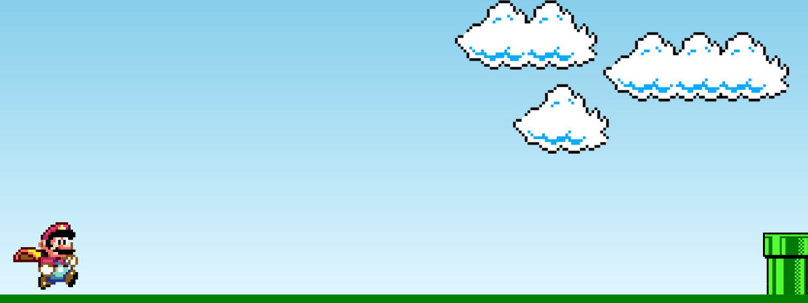

<h1 align="center"> DevLinks </h1>

Jogo simples, onde o Objetivo é superar os Obstáculos pelo percurso  

  <a href="#-tecnologias">Tecnologias</a>&nbsp;&nbsp;&nbsp;|&nbsp;&nbsp;&nbsp;
  <a href="#-projeto">Projeto</a>&nbsp;&nbsp;&nbsp;|&nbsp;&nbsp;&nbsp;
  <a href="#-layout">Layout</a>&nbsp;&nbsp;&nbsp;|&nbsp;&nbsp;&nbsp;
  

 

  

## 🚀 Tecnologias

Esse projeto foi desenvolvido com as seguintes tecnologias:

- HTML e CSS
- JavaScript
- Git e Github

## 💻 Projeto

Um jogo simples com obejtivo de aproundar em JavaScript, Html e CSS

- [Acesse o projeto finalizado, online](https://xBernardes.github.io/jogoMarioJump/)

